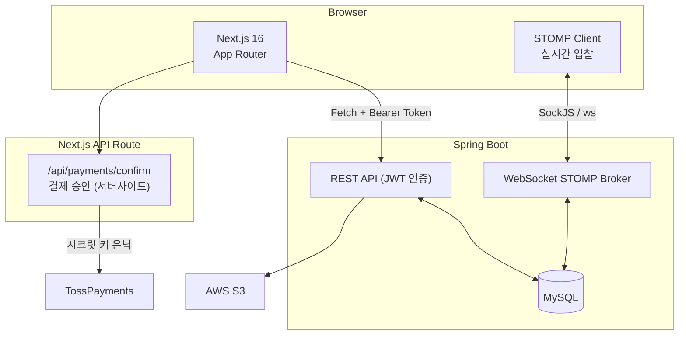

# Blind Chicken Market – Frontend

익명 기반 중고 경매 거래 플랫폼 **Blind Chicken Market**의 프론트엔드 웹 애플리케이션입니다.  
상품 등록 → 실시간 입찰 → 낙찰 → 결제까지 하나의 서비스로 연결되는 전체 거래 플로우를 구현했습니다.

> **포트폴리오 버전**: 원래 Spring Boot 백엔드와 연동한 팀 프로젝트([원본 레포](https://github.com/kt-merge/bcm-front-repository))를 기반으로,  
> 백엔드 없이 단독으로 실행 가능한 Mock API 모드를 추가해 Vercel에 배포하고 있습니다.  
> 인증·상품·경매·결제 전체 플로우를 별도 서버 없이 체험할 수 있습니다.

---

## 프로젝트 개요

| 항목 | 내용 |
|---|---|
| 개발 기간 | 2025.10.31 ~ 2026.01.02 (약 2개월) |
| 팀 구성 | Frontend 2명 (회원용·관리자용 분리), Backend 3명 |
| 담당 | 회원용 프론트엔드 전체 설계 및 개발 |
| 핵심 구현 | 실시간 경매(WebSocket), TossPayments 결제 연동, JWT 인증 + 토큰 갱신 자동화, Mock API |

---

## 화면

> [(원본 배포 주소 — 현재 비활성)](https://bcm.u-jinlee1029.store/) &nbsp;|&nbsp; [(시연 영상)](https://www.youtube.com/watch?v=dM07anPjfsk)

| 메인 | 상품 상세 + 실시간 경매 |
|---|---|
|  |  |

| 상품 등록 | 마이페이지 |
|---|---|
|  |  |

| 결제 | 결제 완료 |
|---|---|
|  |  |

---

## 기술 스택

| 분류 | 기술 | 선택 이유 |
|---|---|---|
| **프레임워크** | Next.js 16 (App Router) | Nested Layout으로 `AuthProvider` 전역 마운트, API Route로 결제 시크릿 키 서버 격리 |
| **언어** | TypeScript 5 strict | API 응답을 `src/types/`로 타입화해 백엔드 스펙 변경 시 런타임 전에 오류 발견 |
| **스타일** | Tailwind CSS v4 + shadcn/ui | 컴포넌트 소유권 유지하며 접근성 기반 UI 구축, Radix UI로 키보드 접근성 확보 |
| **애니메이션** | framer-motion | 페이지·컴포넌트 전환 애니메이션 |
| **실시간** | @stomp/stompjs + sockjs-client | Pub/Sub 채널로 입찰 토픽 구조적 관리, SockJS로 WebSocket 미지원 환경 폴백 보장 |
| **결제** | TossPayments 위젯 | 국내 결제 표준, 위젯 방식으로 PCI DSS 대응 없이 카드·간편결제 통합 |
| **스토리지** | AWS S3 | 이미지 업로드 (Mock 모드에서는 더미 URL 반환) |
| **배포** | Vercel | 포트폴리오 버전 배포 |

---

## 아키텍처

### 실제 백엔드 연동 시



### Mock API 모드 (포트폴리오 배포)

`NEXT_PUBLIC_USE_MOCK_API=true` 환경변수 설정 시, `apiFetch`가 실제 네트워크 요청 없이 `src/mocks/handlers.ts`의 `mockFetch`로 라우팅됩니다. Auth·Products·Users·Orders 엔드포인트를 커버하며, 세션 내 등록 상품은 메모리에 유지됩니다.

---

## 주요 기능 및 구현

| 기능 | 구현 방식 | 성과 |
|---|---|---|
| 실시간 경매 | STOMP Pub/Sub, `useRef`로 클라이언트 생명주기 관리 | 중복 구독 제거, 종료 경매 WebSocket 연결 0건 |
| JWT 인증 + 토큰 갱신 | Mutex 패턴 큐잉 (`isRefreshing` 플래그) | 동시 요청 시 재발급 API 호출 N회 → 1회 |
| TossPayments 결제 | Next.js API Route로 시크릿 키 서버 격리 | 클라이언트에 시크릿 키 노출 없이 결제 승인 처리 |
| IDOR 방지 | 결제 페이지 진입 시 서버 권한 검증 의무화 | URL 직접 입력으로 타인 주문 접근 불가 |
| 무한 스크롤 | Intersection Observer 기반 | 페이지 이동 없는 연속 탐색 경험 |
| Mock API | 환경변수로 토글 가능한 인메모리 핸들러 | 백엔드 없이 전체 플로우 시연 가능 |

---

## 트러블슈팅

### 1) IDOR (비인가 주문 접근) 방지

**문제** — 결제 페이지가 `/payment/{orderId}` 구조여서 URL의 주문 ID만 바꾸면 타인의 주문 정보를 열람하거나 대납이 가능했다. 클라이언트 라우팅 제어는 브라우저 주소창·curl을 통한 직접 접근을 막지 못한다.

**해결** — 페이지 진입 즉시 `usePaymentOrder` 훅에서 주문 조회 API를 호출하고, 서버 에러 코드 기준으로 차단한다.

```ts
// src/hooks/payment/usePaymentOrder.ts
} catch (error) {
  if (
    error instanceof Error &&
    (error.message.includes("403") || error.message.includes("404"))
  ) {
    alert("접근 권한이 없거나 존재하지 않는 주문입니다.");
    router.push("/");
  }
}
```

403(소유자 불일치) / 404(존재하지 않는 주문) 두 경우 모두 메인으로 리다이렉트. 향후 백엔드 에러 응답 구조가 표준화되면 HTTP 상태 코드를 직접 읽는 방식으로 개선할 수 있다.

---

### 2) WebSocket 중복 구독 및 종료 경매 연결 지속

**문제** — `useEffect` 내에서 STOMP 클라이언트를 생성할 때 cleanup 처리 누락으로, 페이지 재진입 시 기존 구독이 해제되지 않은 채 새 구독이 추가되어 동일 입찰 이벤트가 중복 처리되었다.

**해결** — 연결 전 경매 종료 여부를 사전 확인해 불필요한 연결 자체를 차단하고, `useRef`로 클라이언트 인스턴스를 관리해 cleanup에서 반드시 종료되도록 보장한다.

```ts
// src/hooks/useProductDetail.ts

// ① 이미 종료된 경매면 연결 시도 자체를 하지 않음
if (
  product.bidStatus === "COMPLETED" ||
  new Date() > new Date(product.bidEndDate)
) return;

// ② ref로 클라이언트 관리
const clientRef = useRef<Client | null>(null);
clientRef.current = new Client({ webSocketFactory: () => new SockJs(...) });
clientRef.current.activate();

// ③ 언마운트 시 반드시 연결 종료
return () => { clientRef.current?.deactivate(); };
```

종료된 경매 진입 시 WebSocket 연결 요청 0건으로 감소, 중복 처리 제거.

---

### 3) 다중 API 요청 시 액세스 토큰 중복 갱신

**문제** — 페이지 진입 시 병렬로 실행되는 API들이 각자 401을 감지하고 독립적으로 재발급을 시도했다. Refresh Token Rotation 환경에서 두 번째 이후 요청은 이미 무효화된 토큰으로 실패 → 강제 로그아웃.

**해결** — `isRefreshing` 플래그로 재발급 중복 실행을 차단하고, 대기 중인 요청들은 `refreshSubscribers` 큐에 등록해 새 토큰 발급 후 일괄 재시도한다.

```ts
// src/lib/api.ts
let isRefreshing = false;
let refreshSubscribers: Array<(token: string | null) => void> = [];

if (isRefreshing) {
  return new Promise((resolve, reject) => {
    subscribeTokenRefresh(async (newToken) => {
      if (!newToken) { reject(new Error("토큰 재발급 실패")); return; }
      const retryResponse = await fetch(url, {
        ...config,
        headers: { ...config.headers, Authorization: `Bearer ${newToken}` },
      });
      resolve(retryResponse.json());
    });
  });
}

isRefreshing = true;
const newToken = await refreshAccessToken();
onTokenRefreshed(newToken); // 대기 요청에 새 토큰 일괄 전달
isRefreshing = false;
```

동시 5개 요청 기준 재발급 API 호출 5회 → 1회 감소, Race Condition으로 인한 강제 로그아웃 제거.

> **토큰 저장 방식 트레이드오프**  
> Access Token은 현재 `localStorage`에 저장(새로고침 후 유지, XSS 노출 가능).  
> Refresh Token은 `httpOnly + Secure + SameSite` 쿠키(JS 접근 불가).  
> 추후 Access Token을 메모리 저장 + Silent Refresh 방식으로 전환하면 XSS 위험을 낮출 수 있다.

---

## 실행 방법

```bash
# 저장소 클론
git clone https://github.com/kt-merge/bcm-front-repository

# 패키지 설치
npm install

# 환경 변수 설정 (.env.local)
NEXT_PUBLIC_API_URL=http://localhost:8080
NEXT_PUBLIC_TOSS_CLIENT_KEY=
TOSS_SECRET_KEY=

# 백엔드 없이 Mock 데이터로 실행하려면
NEXT_PUBLIC_USE_MOCK_API=true

# 개발 서버 실행
npm run dev
```

> Mock 모드에서는 데모 계정(이메일 임의 입력)으로 로그인하면 전체 기능을 사용할 수 있습니다.

---

## 프로젝트 구조

```
src/
├── app/                          # Next.js App Router 페이지
│   ├── api/payments/confirm/     # TossPayments 결제 승인 (서버 사이드 Route)
│   ├── layout.tsx                # 루트 레이아웃 (AuthProvider)
│   ├── products/[id]/            # 상품 상세 + 실시간 경매
│   └── payment/[orderId]/        # 결제 페이지 (IDOR 방어)
├── components/                   # UI 컴포넌트 (로직 없음)
│   ├── common/                   # 네비게이션, 검색 모달
│   ├── home/                     # 히어로, 무한 스크롤 그리드
│   ├── product/                  # 상품 카드, 입찰 폼, 이미지 갤러리
│   ├── payment/                  # 결제 위젯, 배송 폼, 주문 요약
│   ├── mypage/                   # 프로필, 거래 내역
│   ├── user/                     # 로그인/회원가입 폼
│   └── ui/                       # shadcn/ui 기본 컴포넌트
├── hooks/                        # 비즈니스 로직 (컴포넌트에서 분리)
│   ├── useProductDetail.ts       # 상품 조회 + WebSocket 입찰 연동
│   ├── useInfiniteProducts.ts    # Intersection Observer 무한 스크롤
│   ├── useCreateProductForm.ts   # 상품 등록 폼
│   ├── payment/usePaymentOrder.ts    # 주문 조회 + IDOR 접근 제어
│   ├── payment/useTossPayments.ts    # TossPayments 위젯 초기화
│   └── user/useAuth.tsx              # JWT 인증 Context
├── lib/
│   ├── api.ts        # Fetch 래퍼 (토큰 자동 포함 + Mutex 재발급 큐잉)
│   ├── constants.ts  # 환경별 상수 (Mock 플래그, WebSocket 설정 등)
│   ├── errors.ts     # 에러 정규화
│   └── utils.ts      # 날짜/통화 포맷, JWT 디코딩
├── mocks/
│   ├── data.ts       # 목 상품·카테고리·주문·유저 데이터
│   └── handlers.ts   # 엔드포인트별 목 핸들러 (mockFetch)
└── types/            # TypeScript 타입 (백엔드 API 스펙 기반)
```

---

## 코드 스타일

- **컴포넌트 ↔ 훅 분리**: UI 컴포넌트는 렌더링만 담당, 비즈니스 로직은 `hooks/`에 위임
- Formatter: Prettier (`prettier-plugin-tailwindcss`)
- Linter: ESLint (Next.js 권장 설정)
- TypeScript strict mode — `src/types/`에 API 응답 타입 정의 필수

---

## 참고 자료

- [Next.js Docs](https://nextjs.org/docs)
- [Tailwind CSS Docs](https://tailwindcss.com/docs)
- [shadcn/ui Docs](https://ui.shadcn.com/docs)
- [TossPayments 개발자 센터](https://docs.tosspayments.com/)
- [@stomp/stompjs](https://stomp-js.github.io/stomp-websocket/)
