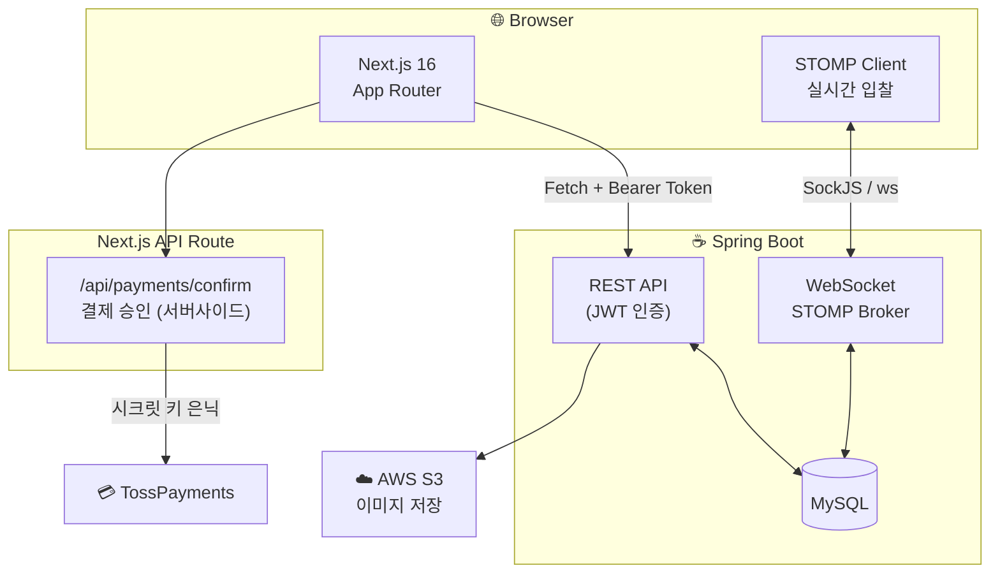

# 🐔 Blind Chicken Market – Frontend (User)

## 🚀 프로젝트 소개

> 익명 기반 중고 경매 거래 플랫폼 **Blind Chicken Market**의 **회원용 프론트엔드 웹 애플리케이션**입니다.  
> 상품 등록 → 실시간 입찰 → 낙찰 → 결제까지 **하나의 서비스로 연결되는 전체 거래 플로우**를 구현했습니다.

### 📍 프로젝트 개요

| 항목 | 내용 |
|---|---|
| 개발 기간 | 2025.10.31 ~ 2026.01.02 (약 2개월) |
| 팀 구성 | Frontend 2명 (회원용·관리자용 분리), Backend 3명 |
| 담당 | 회원용 프론트엔드 전체 설계 및 개발 |
| 핵심 구현 | 실시간 경매(WebSocket), 토스페이먼츠 결제 연동, JWT 인증 + 토큰 갱신 자동화 |

---

## 🏗️ 아키텍처



> TossPayments 시크릿 키는 Next.js API Route(`/api/payments/confirm`)를 통해 서버 사이드에서만 사용해 클라이언트 노출을 차단했습니다.

---

## 🛠️ 기술 스택

### 핵심 기술 선택 근거

| 기술 | 선택 이유 (How / Why) |
|---|---|
| **Next.js 16 App Router** | Nested Layout으로 `AuthProvider`를 앱 전역에 한 번만 마운트, API Route로 결제 시크릿 키를 서버에서 격리 |
| **TypeScript strict** | API 응답을 `src/types/`로 타입 정의해 백엔드 스펙 변경 시 런타임 전에 오류 발견 |
| **STOMP over SockJS** | Raw WebSocket 대비 Pub/Sub 채널(`/topic/products/{id}/product-bids`)로 입찰 토픽을 구조적으로 관리, SockJS로 WebSocket 미지원 환경 폴백 보장 |
| **커스텀 Fetch 래퍼** (axios 미사용) | 토큰 재발급 중복 실행 방지(Mutex 패턴)와 대기 요청 큐잉을 직접 제어하기 위해 외부 의존성 없이 직접 구현 |
| **shadcn/ui + Tailwind CSS v4** | 컴포넌트 소유권을 유지하면서 접근성 기반 UI를 빠르게 구축, 디자인 토큰으로 다크모드 대응 용이 |
| **TossPayments 위젯** | 국내 결제 표준, 위젯 방식으로 PCI DSS 대응 부담 없이 카드·간편결제 통합 |

### 전체 스택 요약

- **Frontend**: Next.js 16, React 19, TypeScript 5, Tailwind CSS v4
- **실시간**: @stomp/stompjs, sockjs-client
- **결제**: TossPayments 위젯 + Next.js API Route
- **스토리지**: AWS S3 (이미지 업로드)
- **Infra**: Docker (standalone), AWS EC2, GitHub

---

## 🎬 화면
> [(배포주소)](https://bcm.u-jinlee1029.store/) <br />
> [(시연영상)](https://www.youtube.com/watch?v=dM07anPjfsk)

### 메인 화면


### 상품 등록


### 상품 상세 페이지 + 실시간 경매화면


### 마이 페이지


### 결제 페이지


### 결제 완료


---

## ✨ 주요 기능 및 성과

| 기능 | 구현 방식 | 성과 |
|---|---|---|
| 실시간 경매 | STOMP Pub/Sub, `useRef`로 클라이언트 생명주기 관리 | 중복 구독 제거, 종료 경매 WebSocket 연결 0건 |
| JWT 인증 + 토큰 갱신 | Mutex 패턴 큐잉 (`isRefreshing` 플래그) | 동시 요청 시 재발급 API 호출 N회 → 1회 |
| 결제 (TossPayments) | Next.js API Route로 시크릿 키 서버 격리 | 클라이언트에 시크릿 키 노출 없이 결제 승인 처리 |
| IDOR 방지 | 결제 페이지 진입 시 서버 권한 검증 의무화 | URL 직접 입력으로 타인 주문 접근 불가 |
| 상품 목록 UX | Intersection Observer 기반 무한 스크롤 | 페이지 이동 없는 연속 탐색 경험 |
| 반응형 UI | Tailwind 반응형 클래스, 모바일 하단 네비게이션 분리 | PC / Mobile 동일 기능 제공 |
| 오류 내성 | API 실패 시 Mock 데이터 폴백, 에러 카테고리별 분기 처리 | 백엔드 장애 상황에서도 화면 유지 |

---

## 🛡️ 트러블슈팅

### 1) URL 직접 입력을 통한 비인가 접근(IDOR) 방지

**문제 상황**

결제 페이지가 `/payment/{orderId}` 구조여서 URL의 주문 ID만 바꾸면 타인의 주문 정보를 열람하거나 타인 명의로 결제를 진행할 수 있었다. UI에서는 버튼을 통한 이동만 제공했지만, 주소창 직접 입력에 대한 실질적인 접근 제어가 없었다.

**왜 프론트엔드 버튼 제어만으로는 부족한가**

클라이언트 라우팅 제어는 정상적인 사용자 흐름을 유도할 뿐, 브라우저 주소창·curl·개발자 도구를 통한 직접 접근은 막지 못한다. 인증 토큰이 있는 로그인 상태에서도 다른 사용자의 orderId로 접근이 가능했기 때문에, **서버 응답을 기준으로 한 접근 제어**가 필수였다.

**해결 방식**

페이지 진입 즉시 `usePaymentOrder` 훅에서 주문 조회 API를 호출하고, 서버 에러 코드를 기준으로 접근을 차단했다.

```ts
// src/hooks/payment/usePaymentOrder.ts
} catch (error) {
  if (
    error instanceof Error &&
    (error.message.includes("403") ||
      error.message.includes("404") ||
      error.message.includes("권한") ||
      error.message.includes("엔티티를 찾을 수 없습니다"))
  ) {
    alert("접근 권한이 없거나 존재하지 않는 주문입니다.");
    router.push("/");
  }
}
```

- `403 Forbidden`: 주문 소유자와 요청 사용자가 다를 때 서버가 반환
- `404 Not Found`: 존재하지 않는 주문 ID 입력 시
- 두 경우 모두 경고 메시지 표시 후 메인 페이지로 리다이렉트

**결과 및 한계**

- 비인가 주문 열람 및 대납 가능성 차단
- 결제 흐름 전체에서 서버 권한 검증이 단일 진입점으로 통합됨
- **한계**: 현재 에러 메시지 문자열 포함 여부로 403/404를 구분하고 있어, 백엔드 에러 응답 구조가 표준화되면 HTTP 상태 코드를 직접 읽는 방식으로 개선할 수 있다

---

### 2) 종료된 경매에서 WebSocket 구독 지속 및 중복 수신 문제

**문제 상황**

경매 종료 후에도 STOMP 구독이 유지되어 불필요한 메시지가 계속 수신되었다. 특히 페이지 재진입 시 이전 구독이 해제되지 않은 채 새 구독이 추가되어, 동일 입찰 이벤트가 중복으로 처리되는 문제가 발생했다.

**원인 분석**
- `useEffect` 내에서 STOMP 클라이언트를 생성할 때 cleanup 처리 누락
- 컴포넌트가 언마운트되어도 소켓 연결이 살아있는 채로 유지됨
- 재진입 시 기존 연결 위에 새 연결이 추가로 열림

**해결 방식**

연결 전 경매 종료 여부를 사전에 확인하여 불필요한 연결 자체를 차단하고, `useRef`로 클라이언트 인스턴스를 관리하여 cleanup에서 반드시 종료되도록 보장했다.

```ts
// src/hooks/useProductDetail.ts

// ① 이미 종료된 경매면 연결 시도 자체를 하지 않음
if (
  product.bidStatus === "COMPLETED" ||
  new Date() > new Date(product.bidEndDate)
) {
  return;
}

// ② ref로 클라이언트 관리 → 재진입 시 이전 인스턴스 참조 없음
const clientRef = useRef<Client | null>(null);
clientRef.current = new Client({ webSocketFactory: () => new SockJs(...) });
clientRef.current.activate();

// ③ 언마운트 시 반드시 연결 종료
return () => {
  clientRef.current?.deactivate();
};
```

**결과 및 한계**

- 종료된 경매 진입 시 WebSocket 연결 요청 0건으로 감소 → 서버 소켓 리소스 절약
- 중복 구독으로 인한 입찰 이벤트 중복 처리 제거
- **한계**: 현재 구조는 경매 종료 이벤트를 서버로부터 실시간으로 수신해 구독을 해제하는 방식이 아니라, 페이지 진입 시점의 상태를 기준으로 연결 여부를 판단한다. 경매 종료 신호를 STOMP 메시지로 수신해 즉시 `unsubscribe()`를 호출하는 방식으로 개선하면 더 정확한 생명주기 관리가 가능하다.

---

### 3) 다중 API 요청 시 액세스 토큰 중복 갱신 문제

**문제 상황**

페이지 진입 시 여러 API가 병렬로 실행되는 상황에서, 각 요청이 독립적으로 401을 감지하고 토큰 재발급(`POST /api/auth/reissue`)을 시도했다. Refresh Token Rotation이 적용된 환경에서 두 번째 재발급 요청은 이미 무효화된 토큰을 사용하므로 실패하고, 결과적으로 사용자가 강제 로그아웃되는 문제가 발생했다.

**왜 라이브러리 대신 직접 구현했는가**

`axios-retry` 같은 라이브러리 도입도 검토했지만, 이미 커스텀 Fetch 래퍼(`api.ts`)를 사용 중이어서 axios로 전환하면 기존 코드 전체를 마이그레이션해야 했다. 추가 의존성 없이 Mutex 패턴으로 직접 구현하는 것이 번들 크기와 코드 제어 측면에서 더 적합하다고 판단했다.

**해결 방식**

`isRefreshing` 플래그로 재발급 중복 실행을 차단하고, 대기 중인 요청들은 `refreshSubscribers` 큐에 등록해 새 토큰 발급 후 일괄 재시도하도록 구현했다.

```ts
// src/lib/api.ts
let isRefreshing = false;
let refreshSubscribers: Array<(token: string | null) => void> = [];

// 401 감지 시: 이미 갱신 중이면 큐에 등록 후 대기
if (isRefreshing) {
  return new Promise((resolve, reject) => {
    subscribeTokenRefresh(async (newToken) => {
      if (!newToken) { reject(new Error("토큰 재발급 실패")); return; }
      const retryResponse = await fetch(url, {
        ...config,
        headers: { ...config.headers, Authorization: `Bearer ${newToken}` },
      });
      resolve(retryResponse.json());
    });
  });
}

// 첫 번째 요청만 실제 재발급 수행
isRefreshing = true;
const newToken = await refreshAccessToken();
onTokenRefreshed(newToken); // 큐의 모든 대기 요청에 새 토큰 전달
isRefreshing = false;
```

**토큰 저장 방식 트레이드오프**

| 토큰 | 현재 저장 위치 | 보안 |
|---|---|---|
| Access Token | `localStorage` | XSS에 노출 가능, 새로고침 후 유지 |
| Refresh Token | httpOnly + Secure + SameSite 쿠키 | JS 접근 불가, XSS 방어 |

Access Token을 메모리(전역 상태)에 두면 XSS 위험이 줄지만, 새로고침 시 토큰이 사라져 `initAuth`에서 Silent Refresh(reissue 자동 호출) 로직이 추가로 필요하다. 현재는 개발 일정상 `localStorage` 방식을 유지하며, 초기화 시 저장된 JWT를 디코딩해 사용자 정보를 복구한다(`useAuth.tsx` > `initAuth`).

**결과 및 한계**

- 동시 5개 요청 기준, 토큰 재발급 API 호출 5회 → 1회로 감소
- Race Condition으로 인한 강제 로그아웃 제거
- **한계**: Access Token을 `localStorage`에 저장하는 현재 구조는 XSS 취약점이 남아있다. 추후 메모리 저장 + Silent Refresh 방식으로 전환하면 보안을 강화할 수 있다.

---

## 📂 프로젝트 구조

```
bcm-front-repository/
├── src/
│   ├── app/                          # Next.js App Router 페이지
│   │   ├── api/
│   │   │   └── payments/
│   │   │       └── confirm/
│   │   │           └── route.ts      # 토스페이먼츠 결제 승인 API (서버 사이드)
│   │   ├── globals.css               # 글로벌 스타일
│   │   ├── layout.tsx                # 루트 레이아웃 (AuthProvider 포함)
│   │   ├── page.tsx                  # 홈 페이지
│   │   ├── login/page.tsx            # 로그인 페이지
│   │   ├── signup/page.tsx           # 회원가입 페이지
│   │   ├── reset-password/page.tsx   # 비밀번호 초기화 페이지
│   │   ├── mypage/page.tsx           # 마이페이지 (구매/판매 내역)
│   │   ├── products/
│   │   │   ├── create/page.tsx       # 상품 등록 페이지
│   │   │   └── [id]/page.tsx         # 상품 상세 + 실시간 경매 페이지
│   │   └── payment/
│   │       ├── [orderId]/page.tsx    # 주문별 결제 페이지
│   │       ├── success/page.tsx      # 결제 성공 페이지
│   │       └── fail/page.tsx         # 결제 실패 페이지
│   │
│   ├── components/                   # 재사용 가능한 UI 컴포넌트
│   │   ├── common/                   # 네비게이션, 검색 모달 등 공통 컴포넌트
│   │   ├── home/                     # 히어로 섹션, 무한 스크롤 그리드, 페이지네이션
│   │   ├── product/                  # 상품 카드, 입찰 폼, 입찰 내역, 이미지 갤러리
│   │   ├── payment/                  # 결제 위젯, 배송 폼, 주소 검색, 주문 요약
│   │   ├── mypage/                   # 프로필, 구매/판매 내역, 사이드바
│   │   ├── user/                     # 로그인/회원가입 폼, 약관 동의
│   │   └── ui/                       # shadcn/ui 기본 컴포넌트
│   │
│   ├── hooks/                        # Custom React Hooks
│   │   ├── useCategories.ts          # 카테고리 조회
│   │   ├── useCreateProductForm.ts   # 상품 등록 폼
│   │   ├── useInfiniteProducts.ts    # 무한 스크롤 상품 조회
│   │   ├── useProductDetail.ts       # 상품 상세 조회 + WebSocket 입찰 연동
│   │   ├── useProducts.ts            # 상품 목록 조회 (정렬/페이징)
│   │   ├── payment/
│   │   │   ├── usePaymentCalculation.ts  # 결제 금액 계산
│   │   │   ├── usePaymentOrder.ts    # 주문 정보 조회 + 접근 제어
│   │   │   └── useTossPayments.ts    # 토스페이먼츠 위젯 초기화 및 결제 요청
│   │   └── user/
│   │       ├── useAuth.tsx           # JWT 기반 인증 상태 관리 (Context)
│   │       ├── useLoginForm.ts       # 로그인 폼
│   │       ├── useMe.ts              # 현재 사용자 정보
│   │       ├── useProductHistory.ts  # 상품 거래 내역
│   │       ├── useSignupForm.ts      # 회원가입 폼
│   │       └── useUserProfile.ts     # 사용자 프로필 수정
│   │
│   ├── lib/                          # 유틸리티, API, 설정
│   │   ├── api.ts                    # Fetch 기반 API 래퍼 (토큰 자동 포함 + 재발급 큐잉)
│   │   ├── constants.ts              # 상수 정의 (WebSocket 설정, 입찰 제한 등)
│   │   ├── errors.ts                 # 에러 정규화 및 사용자 메시지 변환
│   │   └── utils.ts                  # 날짜, 통화 포맷, JWT 디코딩 등 유틸리티
│   │
│   ├── types/                        # TypeScript 타입 정의
│   │   ├── index.ts                  # 타입 export
│   │   ├── auth.ts                   # 인증 관련 타입 (User, JWTPayload 등)
│   │   ├── common.ts                 # 공통 타입
│   │   ├── error.ts                  # 에러 타입 (AppError, ErrorCategory)
│   │   ├── order.ts                  # 주문 타입
│   │   ├── payment.ts                # 결제 타입
│   │   └── product.ts                # 상품 타입
│   │
│   └── mocks/
│       └── products.json             # API 실패 시 사용하는 폴백 목 데이터
│
├── public/                           # 정적 자산 (이미지, 폰트 등)
├── components.json                   # shadcn/ui 설정
├── next.config.ts                    # Next.js 설정 (standalone 빌드, API 프록시)
├── tsconfig.json                     # TypeScript 설정
├── tailwind.config.ts                # Tailwind CSS 설정
├── postcss.config.mjs                # PostCSS 설정
├── eslint.config.mjs                 # ESLint 설정
├── .env                              # 환경 변수
├── .env.example                      # 환경 변수 예시
├── package.json                      # 프로젝트 의존성
├── Dockerfile                        # Docker 이미지 빌드 (standalone)
└── .gitignore
```

---

## ⚙️ 실행 방법

```bash
# 1. 저장소 클론
git clone https://github.com/kt-merge/bcm-front-repository

# 2. 패키지 설치
npm install

# 3. 환경 변수 설정 (.env)
NEXT_PUBLIC_API_URL=http://localhost:8080   # 백엔드 서버 주소
NEXT_PUBLIC_TOSS_CLIENT_KEY=               # 토스페이먼츠 클라이언트 키
TOSS_SECRET_KEY=                           # 토스페이먼츠 시크릿 키 (서버 사이드)

# 4. 개발 서버 실행
npm run dev
```

> **로컬 개발 프록시**  
> `next.config.ts`에 `/api/*` → `http://localhost:8080/api/*` 리라이트 규칙이 설정되어 있어,  
> 개발 환경에서 CORS 없이 백엔드와 통신할 수 있습니다.

---

## 🧹 Code Style

- Formatter: Prettier (`prettier-plugin-tailwindcss` 포함)
- Linter: ESLint (Next.js 권장 설정)
- TypeScript strict mode 사용
- 컴포넌트 단위 책임 분리 (UI 컴포넌트 ↔ 비즈니스 로직 훅 분리)

---

## ✍️ 기술 블로그

프로젝트에서 고민한 내용을 글로 정리했습니다.

<!-- 작성한 블로그 포스팅 링크를 여기에 추가하세요 -->
- [ ] WebSocket(STOMP) 생명주기 관리와 구독 누수 해결기
- [ ] Access Token 저장 전략: localStorage vs 메모리, 트레이드오프 분석
- [ ] Next.js App Router에서 JWT 인증 상태를 전역으로 관리하는 방법

---

## 🔖 참고 자료

- [Tailwind CSS Docs](https://tailwindcss.com/docs/installation/using-vite)
- [shadcn/ui Docs](https://ui.shadcn.com/docs/installation/next)
- [TossPayments 개발자 센터](https://docs.tosspayments.com/)
- [@stomp/stompjs](https://stomp-js.github.io/stomp-websocket/)
